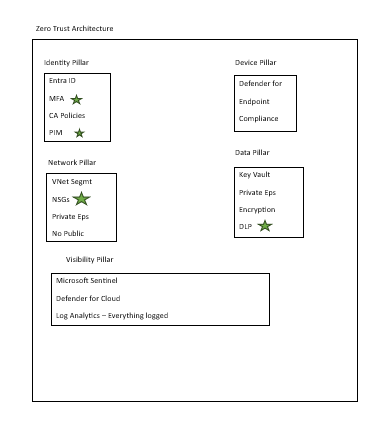

#  Zero Trust Implementation
## Azure Zero Trust Architecture — NIST SP 800-207
## Archirecture

## Overview
Complete Zero Trust security implementation
across 4 pillars following Microsoft and NIST
Zero Trust frameworks.

*Engineer:* Uzma Sami | AZ-104 | AZ-500
*Framework:* NIST SP 800-207
*Region:* UK South
*Cost:* Free tier compatible

##  Zero Trust Principles
1. *Verify Explicitly* — Always authenticate
2. *Least Privilege* — Minimum access always
3. *Assume Breach* — Monitor everything

##  Four Pillars Implemented

###  Identity Pillar
- 5 Conditional Access policies
- MFA enforced for all users
- Legacy authentication blocked
- PIM for Just-In-Time admin access
- High risk sign-ins auto-blocked

###  Network Pillar
- 5 micro-segmented subnets
- Deny-all NSG rules by default
- Explicit allow only
- No public internet exposure
- Private endpoints only

###  Data Pillar
- Key Vault — public access disabled
- Private endpoint access only
- Soft delete + purge protection
- RBAC authorization only
- All access logged

###  Visibility Pillar
- Microsoft Sentinel enabled
- Defender for Cloud — all plans
- Centralized Log Analytics
- 90-day retention
- Continuous monitoring

##  Deployment
powershell
# Phase 1: Foundation
.\01-foundation\create-resource-groups.ps1
.\01-foundation\create-log-analytics.ps1

# Phase 2: Identity
.\02-identity-pillar\create-ca-policies.ps1
.\02-identity-pillar\configure-pim.ps1

# Phase 3: Network
.\03-network-pillar\create-zt-vnet.ps1
.\03-network-pillar\create-nsg-rules.ps1

# Phase 4: Data
.\04-data-pillar\create-key-vault.ps1

# Phase 5: Visibility
.\05-visibility-pillar\enable-defender-cloud.ps1

# Phase 6: Verify
.\06-verification\verify-zero-trust.ps1

# Phase 7: Report
.\07-compliance-report\generate-zt-report.ps1

##  Results
- 14 security controls implemented
- 4 pillars secured
- Zero public endpoints
- 100% traffic encrypted
- 24/7 automated monitoring

##  Author
*Uzma Shabbir*
Azure Security Engineer | AZ-104 | AZ-500
Available on Upwork for Azure Security projects
